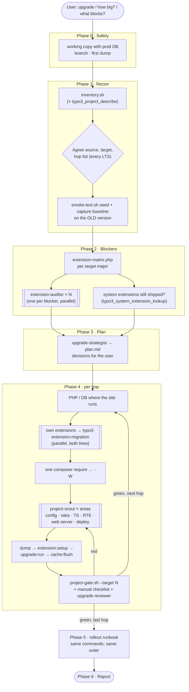

# TYPO3 Project Migration

A Claude Code plugin that upgrades **whole TYPO3 projects** (an installation
with its sites, database, configuration and extensions) from **v10 to v14**,
one LTS at a time, and proves each step against how the site behaved before.

It's the sister of
[typo3-extension-migration](https://github.com/hojalatheef/typo3-extension-migration),
which migrates the code of one extension. This plugin orchestrates the
project around it: environment, Composer resolution of core and third-party
extensions, the project's own extensions, system and site configuration,
TypoScript, RTE, database schema and upgrade wizards, smoke tests and the
production runbook. It can use the official
[TYPO3 Dev Companion](https://github.com/TYPO3/dev-companion) for
version-exact answers.

- [What you get](#what-you-get)
- [Install](#install)
- [Use](#use)
- [How it works](#how-it-works)
- [TYPO3 Dev Companion](#typo3-dev-companion)
- [Working state in `.project-migration/`](#working-state-in-project-migration)
- [How "done" is defined](#how-done-is-defined)
- [Guard hook](#guard-hook)
- [Develop](#develop)

## What you get

| Piece | Kind | What it does |
| --- | --- | --- |
| `typo3-project-migration` | skill | End-to-end: safety → recon → blockers → plan → per-hop runbook → rollout runbook → report, with a resumable ledger |
| `assess` | skill | Read-only sizing: hops, blocking extensions (live Packagist check), own code, environment gaps, S/M/L/XL rating |
| `verify` | skill | Project gate per hop, manual backend checklist, adversarial review |
| `dev-companion` | skill | Checks or sets up the TYPO3 Dev Companion MCP server for this workflow |
| `project-scout` | agent (Haiku) | Read-only sweep of one project area (config, sites, TypoScript, RTE, forms, web server, deployment…) per hop |
| `extension-auditor` | agent (Sonnet) | One blocking third-party extension: release, fork, patch, replacement or drop |
| `upgrade-strategist` | agent (Opus) | Hop plan, user decisions, production runbook draft |
| `upgrade-reviewer` | agent (Opus) | Adversarial review of a finished hop |
| guard hook | PreToolUse | No database-writing step without a fresh dump. Asks before destructive schema changes. Blocks `--ignore-platform-reqs` and `--no-verify` |

Supporting material in `skills/typo3-project-migration/`:

| Path | Contents |
| --- | --- |
| `references/hop-v10-to-v11.md` … `hop-v13-to-v14.md` | Project-level changes per hop, each line tied to a core changelog entry |
| `references/upgrade-order.md` | The order of operations for one hop, with commands and the manual checklist |
| `references/version-matrix.md` | PHP, database, Composer installers and console commands per line |
| `references/project-areas.md` | Every area of a project to check, with typical findings |
| `references/own-extensions.md` | How own extensions are handed to typo3-extension-migration or the Dev Companion |
| `references/classic-mode.md` | Non-Composer projects: switch first, or upgrade in classic mode |
| `references/dev-companion.md` | Which Dev Companion tool fits which phase, and its coverage gaps |
| `references/troubleshooting.md` | Symptom → cause → fix |
| `scripts/inventory.sh` | Project facts: mode, core, constraints, own and third-party extensions, config files, sites, DDEV, deployment (text or `--json`) |
| `scripts/extension-matrix.php` | Every dependency that requires `typo3/cms-*` vs. each target major on Packagist: `ok`, `upgrade → x.y.z`, `none`, `unknown` |
| `scripts/smoke-test.sh` | `seed` URLs from site configs and sitemaps, `capture` a baseline, `compare` after each hop |
| `scripts/project-gate.sh` | Core version, composer validate, platform requirements, console, cache flush, pending wizards, smoke, error log, with one verdict |
| `scripts/t3.sh` | Runs the TYPO3 console the way the project runs it (DDEV-aware, Composer or classic) |
| `scripts/changelog-lookup.sh` | Prints the official core changelog entry for an id, issue number or keyword |

## Install

```bash
# as a marketplace (this repository is its own marketplace)
/plugin marketplace add hojalatheef/typo3-project-migration
/plugin install typo3-project-migration@typo3-project-migration

# or for local development
claude --plugin-dir /path/to/typo3-project-migration
```

Requirements on the machine running Claude Code: `bash`, `git`, `jq`, `curl`,
`composer`, and PHP 7.4+ (for `extension-matrix.php`, which can also run in
DDEV). Recommended: DDEV for the working copy. Optional: the
typo3-extension-migration plugin for own extensions, and the TYPO3 Dev
Companion.

## Use

Ask:

- "Upgrade this TYPO3 project from 11 to 13."
- "How much work is it to bring this site to TYPO3 14?"
- "Which extensions block the update to v13?"

Or invoke the skills directly:

```text
/typo3-project-migration:assess 14
/typo3-project-migration:typo3-project-migration
/typo3-project-migration:verify 13
/typo3-project-migration:dev-companion check
```

The scripts also run on their own, from the project root:

```bash
S=/path/to/typo3-project-migration/skills/typo3-project-migration/scripts
$S/inventory.sh
php $S/extension-matrix.php --targets 12,13,14
$S/smoke-test.sh seed && $S/smoke-test.sh capture baseline
$S/project-gate.sh --target 13
```

## How it works



Principles:

- **One LTS at a time, booted and migrated.** Each intermediate LTS must run against the database and finish its upgrade wizards, because later majors drop earlier wizards. Important-106532 says the v14 scheduler wizard "needs to be performed in the context of TYPO3 v14".
- **Revertible until the database is touched.** Code is in git. The database needs a dump before every step that writes it, and the hook enforces that.
- **The site's own pages are the test suite.** A smoke baseline is captured on the old version, and every hop is compared against it.
- **Facts before edits.** Inventory, extension matrix and the official changelog decide. Every card line names its changelog entry.

## TYPO3 Dev Companion

TYPO3 published the
[Dev Companion](https://news.typo3.com/article/meet-the-typo3-dev-companion-typo3-knowledge-for-your-coding-agent)
in October 2026. It's a local, read-only MCP server (PHP 8.2+) from the TYPO3
Association with 33 tools and 14 task skills. It answers from the installed
core, the official documentation, Forge, Gerrit and the Extension Repository,
names the source of every answer, and is version-bound to **12.4, 13.4,
14.3 and main**.

What was evaluated, and how this plugin uses it:

| Question | Finding | Consequence here |
| --- | --- | --- |
| Can a plugin bundle it? | No. It needs a Composer-installed checkout and starts inside the project it describes. It isn't released on Packagist yet (0.x, installed from git). | Optional. The `dev-companion` skill installs a standalone checkout and runs its own installer with `--agent=claude` (writes `.mcp.json` and `.claude/skills/`), with the user's consent |
| Does it upgrade projects? | Its `typo3-extension-upgrade` skill covers one package. Its knowledge has an "installation upgrade" hint with the right order (code → schema → wizards → caches), but no project workflow. | This plugin owns the project order. The Dev Companion supplies the facts at each step |
| Which tools matter? | `typo3_project_describe`, `typo3_changelog_lookup` (reads docs.typo3.org, so it covers versions that aren't installed), `typo3_system_extension_lookup`, `typo3_ter_lookup`, `typo3_documentation_lookup`, `typo3_hint_lookup`, `typo3_configuration_lookup`, `typo3_commit_message_guide` | Mapped per phase in `references/dev-companion.md` |
| Old projects (v10/v11)? | Not covered by its knowledge. It also needs PHP 8.2, which an old project's DDEV container doesn't have. | Run it from a standalone checkout on the host PHP. For hops below 12.4, the bundled changelog script is the source |
| Does it see the new core after `composer update`? | No. A running server keeps describing the core it started with | The workflow asks for a reconnect in `/mcp` after every hop |

Without the Dev Companion, the plugin works on its own scripts and the
official changelog. The final report says which one was used.

## Working state in `.project-migration/`

| File | Holds |
| --- | --- |
| `inventory.json`, `matrix.md` | facts from recon and blockers |
| `plan.md`, `runbook.md` | the plan per hop and the production sequence |
| `ledger.md` | one line per finding: `id · area · status · note`, so a new session resumes there |
| `urls.txt`, `smoke/*.tsv` | smoke URLs, `baseline` and per-gate captures |
| `backups/` | database dumps per hop. Never commit them |

## How "done" is defined

A hop is done when `project-gate.sh --target <N>` exits 0, the manual backend
checklist passed with the user, and the `upgrade-reviewer` has no open
`blocker`. A `SKIPPED` gate line is a gap, not a pass. Every accepted smoke
difference is in the ledger with the user's name on it. Production steps are
prepared as a runbook and run by people.

## Guard hook

`hooks/scripts/guard-bash.sh` runs before every Bash call:

| Command | Decision |
| --- | --- |
| `typo3 extension:setup`, `upgrade:run`, `upgrade:mark:undone`, `database:updateschema` (also via `t3.sh`, `ddev exec`) without a dump from the last 24 h in `.project-migration/backups/` or `.ddev/db_snapshots/` | deny, with the commands to take one |
| destructive schema changes, `ddev import-db`, `ddev delete`, `DROP DATABASE/TABLE`, `TRUNCATE` | ask the user |
| `composer install/update/require … --ignore-platform-req(s)` | deny |
| `git … --no-verify`, `git commit -n` | deny |

## Develop

```bash
npm install
npm test            # self-test (scripts, hook, matcher, fixture) + Markdown lint
npm run lint:sh     # shellcheck
npm run validate    # claude plugin validate --strict
```

The self-test needs a working PHP for the matrix checks: `PHP_BIN=/path/to/php`,
the `php` on `PATH`, or a running Docker (it then uses `php:8.4-cli`).

See [CONTRIBUTING.md](CONTRIBUTING.md). Licensed under MIT.
